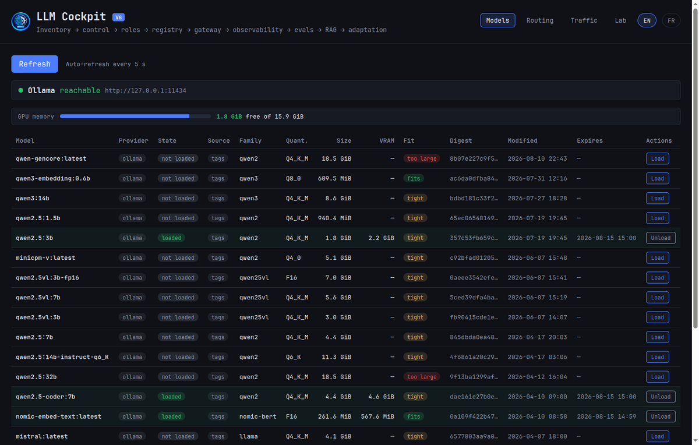
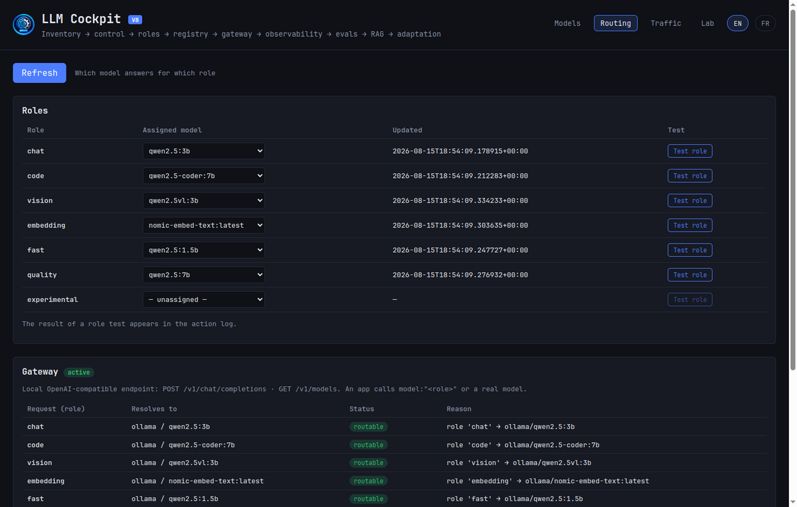
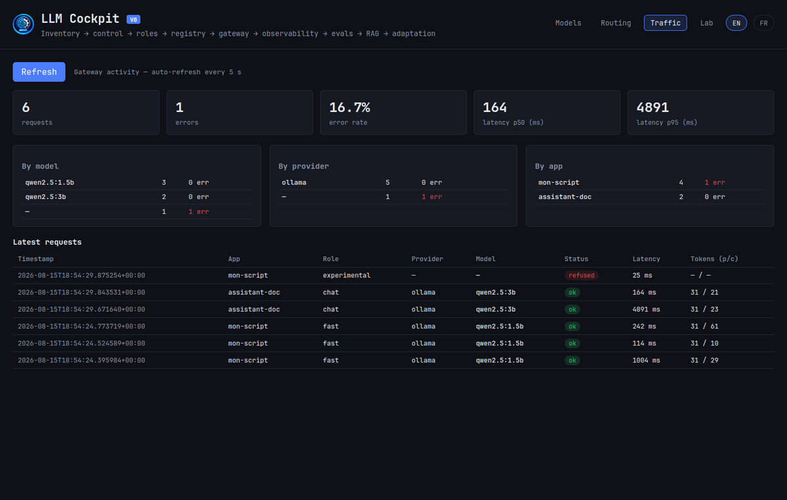
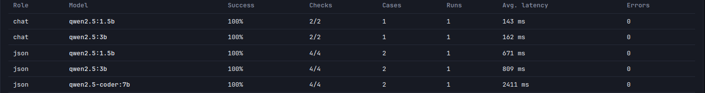
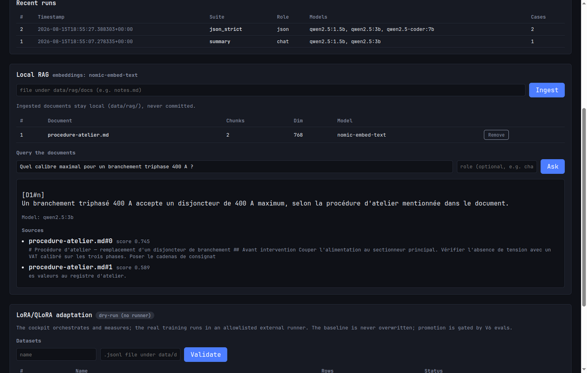

# LLM Cockpit — formation

Formation à l'usage, construite sur des captures réelles de ton poste : ta
RTX 5080 de 16 Go, tes 15 modèles Ollama. Aucune illustration inventée.

---

## 1. La plus-value, en une page

### Ce que tu fais aujourd'hui sans le cockpit

Tu ouvres un terminal. `ollama list` te donne des tailles en octets. `ollama ps`
te dit ce qui est chargé. Pour savoir si un modèle va rentrer dans ta carte, tu
comptes les chiffres de tête. Tu lances un modèle, ça rame, tu ne sais pas si
c'est parce qu'il a débordé sur le CPU ou parce que le modèle est lent. Tes
scripts ont chacun le nom d'un modèle en dur ; quand tu changes de modèle, tu
édites cinq fichiers. Et quand tu te demandes « lequel est le meilleur pour
ça ? », tu réponds à l'intuition.

### Ce que le cockpit ajoute

| Il répond à | Sans le cockpit | Avec |
|---|---|---|
| Est-ce que ce modèle rentre dans ma carte ? | Calcul mental sur des octets | Un mot par ligne : `fits`, `tight`, `too large` |
| Quel modèle répond pour « code » ? | Codé en dur dans chaque script | Un réglage, changé en un clic |
| Qui a appelé quoi, et combien de temps ? | Invisible | Journal horodaté par application |
| Lequel est réellement meilleur ? | À l'intuition | Score et latence mesurés côte à côte |
| Répondre depuis mes documents | Rien | Réponse sourcée, extraits cités |

### La vraie plus-value, en une phrase

**Le cockpit transforme des décisions prises à l'aveugle en décisions prises
sur des chiffres**, sans jamais rien envoyer hors de ta machine.

Trois garanties tenues par le code :

- **Rien n'est inventé.** Un modèle absent est une erreur, jamais un
  remplacement silencieux. Une mesure impossible affiche `—`, jamais un chiffre
  plausible.
- **Le baseline n'est jamais écrasé.** Une adaptation crée une version à côté.
- **« Actif » ne veut pas dire « servi ».** Le cockpit refuse de te laisser
  croire que ta production utilise un modèle qu'elle n'utilise pas.

---

## 2. Le tour du propriétaire

Quatre onglets, découpés par ce que tu cherches à faire.

| Onglet | Tu y vas quand | Fréquence réelle |
|---|---|---|
| **Models** | Tu veux charger, décharger, tester un modèle | Tous les jours |
| **Routing** | Tu changes quel modèle fait quoi | Quelques fois par mois |
| **Traffic** | Quelque chose est lent ou a échoué | Quand ça cloche |
| **Lab** | Tu compares, tu interroges tes docs, tu adaptes | Séances dédiées |

Chaque onglet ne rafraîchit que ce qu'il affiche.

---

## 3. Scénarios

### Scénario 1 — « Est-ce que ce modèle va rentrer ? »

**La situation.** Tu veux essayer `qwen2.5:32b`. Il fait 18,5 Go, ta carte en a
15,9. Sans le cockpit, tu le charges, ça rame, et tu ne sais pas pourquoi.

**Le geste.** Onglet **Models**. Tu lis la colonne `Fit`.



**Ce que tu lis sur cette capture :**

- **1,8 Go libres sur 15,9** — trois modèles sont déjà chargés (`loaded`), et
  la colonne VRAM montre ce que chacun consomme réellement : 2,2 Go pour
  `qwen2.5:3b`, 4,6 Go pour `qwen2.5-coder:7b`.
- `qwen-gencore` et `qwen2.5:32b` sont **`too large`** : 18,5 Go ne rentreront
  jamais dans 15,9 Go. Les charger, c'est accepter que le modèle déborde sur le
  CPU et rame.
- Presque tout le reste est **`tight`** : ça tiendrait sur une carte vide, mais
  plus dans les 1,8 Go qui restent maintenant.
- Seuls les deux petits modèles d'embedding restent **`fits`**.

**Le réflexe à prendre :** les verdicts bougent quand tu charges. Décharge ce
que tu n'utilises pas et regarde `tight` redevenir `fits`.

**Ce que ça t'évite :** charger un modèle qui déborde, attendre trois minutes,
et conclure à tort que « le modèle est mauvais ».

---

### Scénario 2 — « Je veux changer de modèle sans toucher à mes scripts »

**La situation.** Ton script utilise `qwen2.5-coder:7b`. Tu veux essayer un
autre modèle pour le code. Sans le cockpit, tu édites chaque script.

**Le geste.** Onglet **Routing**. Tu changes le modèle du rôle `code`. Fini.



**Comment ça marche.** Ton script n'appelle plus un modèle, il appelle un
**rôle** :

```bash
curl http://127.0.0.1:22050/v1/chat/completions \
  -H 'Content-Type: application/json' \
  -H 'x-cockpit-app: mon-script' \
  -d '{"model": "code", "messages": [{"role": "user", "content": "..."}]}'
```

Le champ `model` vaut `code`, pas `qwen2.5-coder:7b`. Le cockpit résout. Tu
changes l'assignation dans l'interface, ton script suit sans être modifié.

La table **Gateway** te montre à tout moment vers quoi chaque rôle résout, et
pourquoi. Un rôle non assigné apparaît `not routable` avec sa raison — le
cockpit ne choisit jamais un modèle de remplacement dans ton dos.

**Ce que ça t'évite :** cinq fichiers à éditer, et l'oubli qui laisse un script
sur l'ancien modèle.

> **L'en-tête `x-cockpit-app` est facultatif — mets-le quand même.** C'est lui
> qui rend le scénario 3 utilisable.

---

### Scénario 3 — « C'est lent, et je ne sais pas pourquoi »

**La situation.** Ton assistant met parfois cinq secondes à répondre. Parfois
non. Tu ne sais pas d'où ça vient.

**Le geste.** Onglet **Traffic**.



**Ce que cette capture raconte** — six requêtes réelles :

- **p50 à 164 ms, p95 à 4891 ms.** La moitié des requêtes répond en 164 ms,
  mais les plus lentes prennent près de 5 secondes. Ce n'est pas « c'est lent »,
  c'est « c'est irrégulier ».
- Le journal donne le coupable : la requête à **4891 ms** est la **première**
  vers `qwen2.5:3b` — le temps de charger le modèle en mémoire. Les suivantes
  tombent à 164 ms.
- **Un taux d'erreur de 16,7 %**, une requête `refused` : le rôle
  `experimental` n'était assigné à rien. Le cockpit a refusé au lieu de choisir
  un modèle au hasard.
- La répartition **par application** (`mon-script` 4, `assistant-doc` 2) vient
  de l'en-tête `x-cockpit-app`.

**Le diagnostic qu'on en tire :** garde ton modèle chargé si tu veux des
réponses régulières. La lenteur venait du chargement, pas du modèle.

---

### Scénario 4 — « Lequel choisir ? » (le scénario qui rapporte le plus)

**La situation.** Tu dois produire du JSON strict. Tu supposes qu'il faut le
gros modèle spécialisé. Tu supposes.

**Le geste.** Onglet **Lab**, panneau Scoreboard. Tu choisis la suite
`json_strict`, tu listes trois modèles, tu lances.



**Le résultat, mesuré :**

| Modèle | Réussite | Latence moyenne |
|---|---|---|
| `qwen2.5:1.5b` | 100 % | **671 ms** |
| `qwen2.5:3b` | 100 % | 809 ms |
| `qwen2.5-coder:7b` | 100 % | **2411 ms** |

**Les trois réussissent à 100 %. Le plus gros est 3,6 fois plus lent.**

Pour cette tâche, `coder:7b` ne t'apporte rien : il coûte 4,6 Go de VRAM et
1,7 seconde de plus par requête, pour le même résultat. Le petit modèle suffit.

**Ce que ça t'évite :** immobiliser un tiers de ta carte graphique et tripler
tes temps de réponse pour un gain nul. C'est le genre de décision qu'on ne peut
pas prendre à l'intuition — il fallait la mesurer.

Les évaluations passent par le **routage réel**. Tu mesures le chemin que tes
applications empruntent, pas un chemin de laboratoire. Et le code généré n'est
jamais exécuté.

---

### Scénario 5 — « Répondre à partir de mes documents »

**La situation.** Tu as une procédure d'atelier. Tu veux poser une question et
obtenir une réponse **avec la source**, pas une invention plausible.

**Le geste.** Onglet **Lab**, panneau Local RAG. Tu déposes le fichier dans
`~/.local/state/llm-cockpit/rag/docs/`, tu l'ingères, tu poses ta question.



**Ce que tu obtiens :**

- La réponse : *« Un branchement triphasé 400 A accepte un disjoncteur de 400 A
  maximum »* — c'est exactement ce que dit le document.
- **Le modèle qui a répondu** : `qwen2.5:3b`.
- **Les sources**, avec leur score de pertinence : `procedure-atelier.md#0`
  (0,745) et `#1` (0,589), extraits à l'appui.

**Pourquoi les sources changent tout.** Tu peux vérifier. Si la réponse ne te
plaît pas, tu vois immédiatement si le modèle a mal lu, ou si le document ne
contenait pas l'information. Et si aucune source ne correspond, le cockpit le
dit au lieu de répondre quand même.

Formats acceptés : `.txt`, `.md`, `.pdf`. Un PDF scanné sans texte extractible
est refusé plutôt qu'ingéré vide.

Tes documents ne quittent jamais la machine et ne sont jamais versionnés.

---

### Scénario 6 — « Spécialiser un modèle sur mon style »

**La situation.** Tu veux qu'un modèle réponde dans le vocabulaire de tes
procédures.

**Le geste.** Onglet **Lab**, panneau Adaptation. Tu déposes un `.jsonl`
d'exemples, tu valides, tu lances un job.

Le cockpit **orchestre et mesure** ; l'entraînement réel tourne dans un
exécutant externe que tu déclares via `TRAIN_RUNNER`. Sans cette variable, tout
reste en **dry-run** : le cockpit prépare, valide, et affiche la commande qui
*aurait* été lancée. C'est le mode par défaut, et c'est volontaire.

**Le garde-fou qui compte.** La promotion d'une version adaptée est **refusée**
si elle ne fait pas mieux que le baseline aux évaluations. Tu ne peux pas
promouvoir un modèle qui régresse, même par erreur.

**Et l'avertissement à comprendre :** promouvoir marque la version active *dans
le registre*, mais le gateway continue de servir le modèle de base. Le cockpit
préfère te le dire plutôt que de te laisser croire le contraire.

---

## 4. Ce que le cockpit ne fait pas

Aussi important que le reste.

- **Il ne démarre pas Ollama.** Si Ollama n'écoute pas, il te le dit et
  s'arrête là.
- **Il ne supprime aucun modèle.** Trois actions seulement : charger,
  décharger, tester. C'est figé dans le code.
- **Il n'entraîne pas.** Il orchestre un exécutant externe que tu déclares.
- **Il n'envoie rien à l'extérieur.** Tout est sur `127.0.0.1`.
- **Il ne stocke pas tes invites** — sauf si tu mets `LOG_PROMPTS=1`.

---

## 5. Ton premier quart d'heure

1. Lance **LLM Cockpit** depuis ton menu d'applications.
2. Onglet **Models** : regarde ta mémoire libre et la colonne `Fit`. Charge un
   modèle marqué `fits`, observe les autres passer à `tight`.
3. Onglet **Routing** : assigne un modèle aux rôles `chat`, `code` et `fast`.
4. Depuis un terminal, appelle le gateway avec `"model": "code"` et
   l'en-tête `x-cockpit-app: essai`.
5. Onglet **Traffic** : ta requête est là, avec sa latence et son application.
6. Onglet **Lab** : lance `json_strict` sur deux modèles et regarde lequel est
   le plus rapide à score égal.

Au bout de ces six étapes, tu as utilisé les quatre onglets et tu as pris une
décision fondée sur une mesure plutôt que sur une impression.
