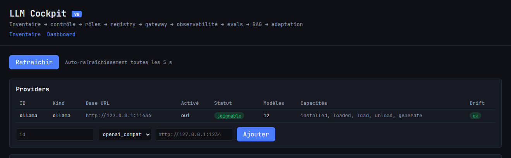
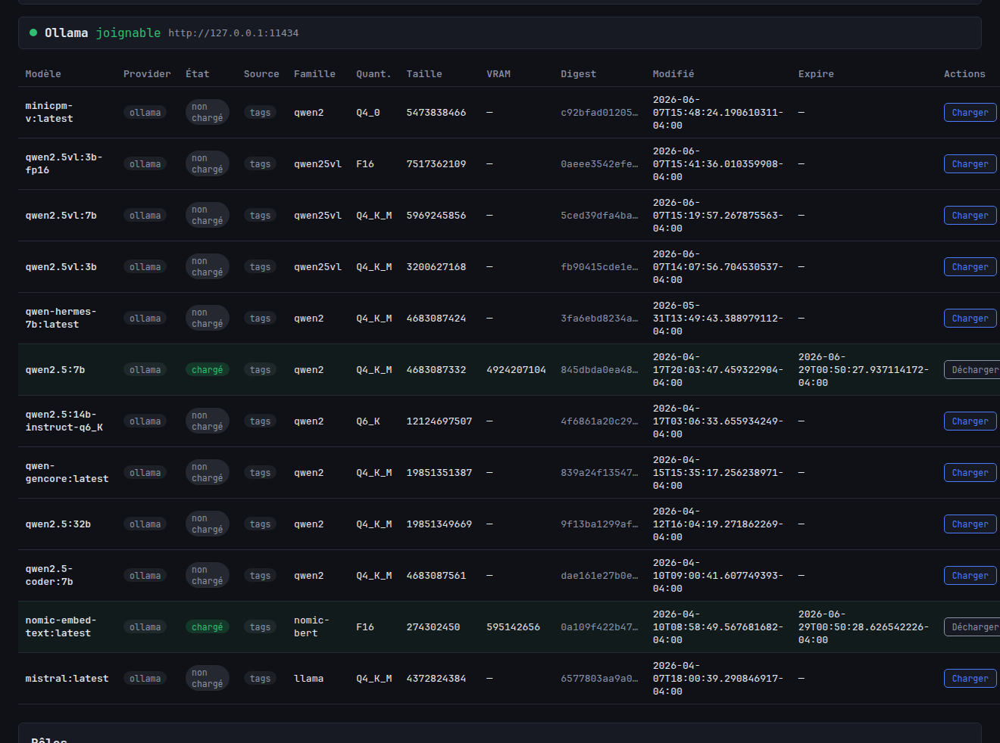
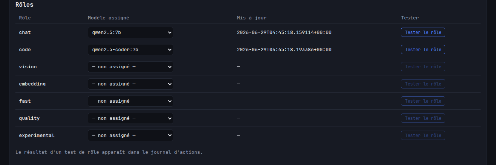
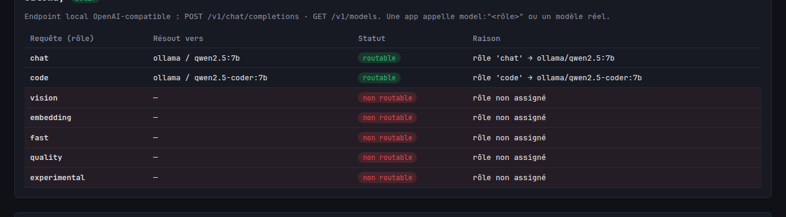
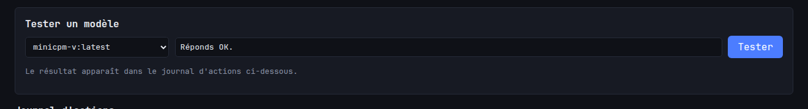
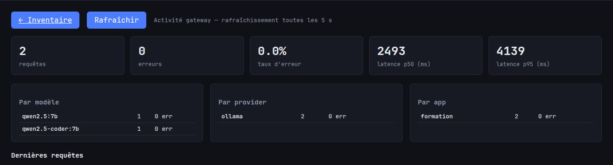
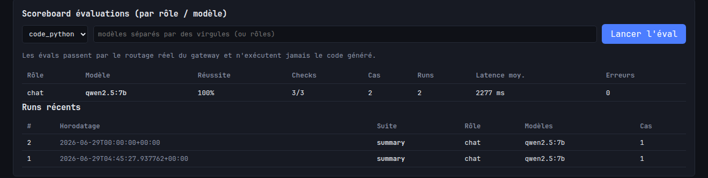
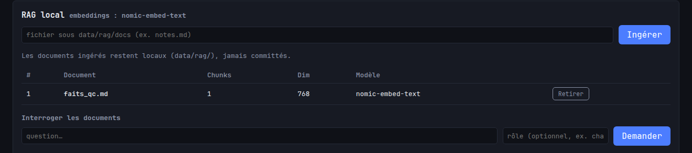
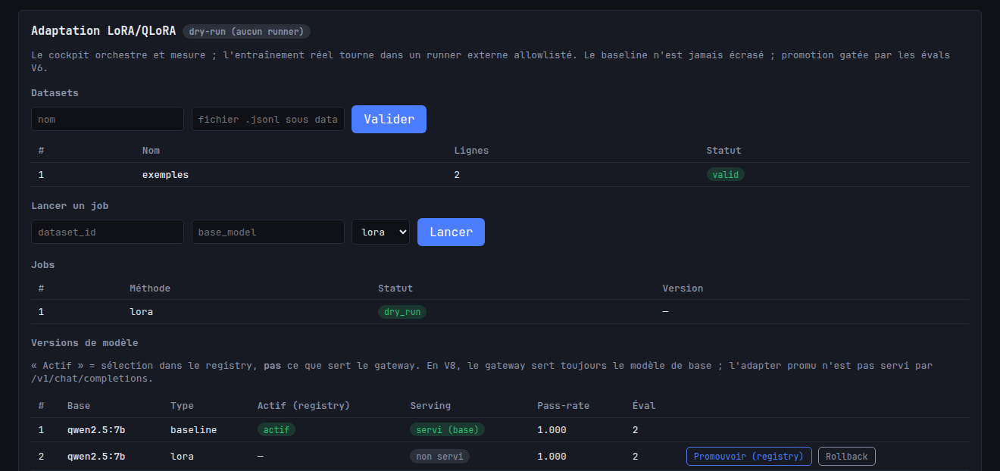
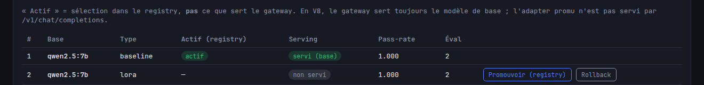

# Formation — Interface LLM Cockpit V8

Guide complet d'utilisation de l'interface web de **LLM Cockpit V8**. Destiné à
un nouvel utilisateur qui ouvre le cockpit pour la première fois et veut être
autonome : comprendre l'interface, configurer les rôles, tester un modèle,
utiliser le gateway, lire le dashboard, lancer une évaluation, tester le RAG et
comprendre la section adaptation.

> Captures d'écran réelles dans `screenshots/`. Elles ont été prises sur une
> machine où Ollama tourne avec 12 modèles installés ; ton inventaire peut
> différer.

---

## 1. Présentation générale

LLM Cockpit est un **cockpit local-first** pour piloter plusieurs LLM locaux.
Tout tourne sur ta machine (`127.0.0.1`), aucune donnée ne sort, aucun service
cloud n'est requis. L'application est un **orchestrateur** : elle observe,
route, mesure et compare — elle n'est pas un laboratoire d'entraînement.

L'interface a deux pages :

- **Inventaire** (`/`) : ce que tu as, ce qui est chargé, les rôles, le routage.
- **Dashboard** (`/dashboard`) : observabilité, évaluations, RAG, adaptation.



La barre du haut affiche le badge de version **V8**, le fil
`Inventaire → contrôle → rôles → registry → gateway → observabilité → évals →
RAG → adaptation` (les 9 capacités empilées de V0 à V8), et deux liens de
navigation : **Inventaire** et **Dashboard**.

### À quoi sert l'application

| Tu veux…                                            | Va dans…            |
|-----------------------------------------------------|---------------------|
| Voir les modèles installés / chargés                | Inventaire          |
| Charger / décharger / tester un modèle              | Inventaire          |
| Dire « pour le code, utilise tel modèle »           | Inventaire → Rôles  |
| Faire parler une app à tes modèles via une API      | Gateway (`/v1/*`)   |
| Savoir qui a appelé quoi, à quelle latence          | Dashboard → stats   |
| Comparer 2 modèles avec des preuves                 | Dashboard → évals   |
| Répondre à partir de tes documents locaux           | Dashboard → RAG     |
| Orchestrer une adaptation LoRA/QLoRA                 | Dashboard → Adaptation |

---

## 2. Les huit briques (V0 → V8)

Chaque phase ajoute une couche, sans casser la précédente.

| Brique          | Rôle                                                                    |
|-----------------|-------------------------------------------------------------------------|
| **Inventaire**  | Liste les modèles **installés** et **chargés en mémoire** (lecture seule). |
| **Providers**   | Registry des moteurs (Ollama, OpenAI-compatible). Inventaire **agrégé**. |
| **Rôles**       | Associe un **usage** (chat, code…) à un modèle réel, persisté localement. |
| **Gateway**     | Endpoint local **OpenAI-compatible** ; route une requête par rôle/modèle. |
| **Observabilité** | Logue chaque requête gateway en SQLite ; stats + dashboard.           |
| **Évaluations** | Compare des modèles sur des suites locales, avec des **checks** ; scoreboard. |
| **RAG**         | Ingestion de documents locaux → réponses **avec sources**, mesuré vs non-RAG. |
| **Adaptation**  | Orchestre un job LoRA/QLoRA, compare au baseline, promeut **si** les évals le justifient. |

Différences importantes à retenir :

- **Providers ≠ Rôles** : un provider est un *moteur* (où tournent les modèles) ;
  un rôle est un *usage* pointant vers un modèle précis.
- **Gateway ≠ Inventaire** : l'inventaire *montre* ; le gateway *sert* une API.
- **Évaluations ≠ Observabilité** : l'observabilité mesure le trafic réel ; les
  évals mesurent la *qualité* sur des cas de test contrôlés.
- **Adaptation ≠ serving** : promouvoir une version adaptée la sélectionne dans
  le *registry*, mais **ne la sert pas** par le gateway (voir §12).

---

## 3. La page Inventaire (`/`)

**À quoi ça sert** : voir l'état réel de tes moteurs et modèles, et déclencher
les actions de base. La page se rafraîchit automatiquement toutes les 5 s ; le
bouton **Rafraîchir** force une mise à jour immédiate.

De haut en bas : **Providers**, statut **Ollama**, table des **modèles**,
**Rôles**, **Gateway**, **Tester un modèle**, **Journal d'actions**.

### 3.1 Providers


- **À quoi ça sert** : déclarer et surveiller les moteurs. Ollama est le
  provider par défaut. Tu peux en ajouter un OpenAI-compatible (LM Studio,
  llama.cpp server…).
- **Ce qu'on voit** : `id`, `kind`, `base_url`, activé (oui/non), statut
  (joignable / injoignable), nombre de modèles, capacités, **drift**.
- **Où cliquer / quoi entrer** : pour ajouter un provider, remplis `id`, choisis
  le `kind` (`openai_compat` ou `ollama`), entre la `base_url`, puis **Ajouter**.
- **Drift** : « ok » quand l'état déclaré correspond à la réalité ; un drift
  signale par exemple « déclaré actif mais injoignable ».
- **Erreurs fréquentes** : `id` ou `base_url` déjà pris → refus (HTTP 409) ;
  `kind` inconnu → refus (HTTP 400).

### 3.2 Table des modèles



- **À quoi ça sert** : voir chaque modèle, son provider, s'il est **chargé** en
  mémoire, sa taille, sa VRAM, son digest, sa quantisation.
- **Ce qu'on voit** : une ligne par modèle. La colonne **État** indique
  `chargé` (en mémoire, surligné) ou `non chargé`. La colonne **Provider**
  permet de distinguer les modèles quand plusieurs providers sont branchés.
- **Où cliquer** : bouton **Charger** (modèle non chargé) ou **Décharger**
  (modèle chargé) à droite de chaque ligne. Ces actions ne touchent que la
  mémoire : elles ne suppriment jamais un modèle du disque.
- **Erreurs fréquentes** : les boutons d'action n'apparaissent que pour les
  modèles **Ollama** (les modèles OpenAI-compatibles ne supportent pas
  load/unload).

### 3.3 Rôles



Voir §5 pour le détail. En bref : associe un usage à un modèle via le menu
déroulant, puis teste le rôle avec le bouton **Tester le rôle**.

### 3.4 Gateway (résolution)



Voir §7. La table montre, pour chaque rôle, vers quel `provider/modèle` une
requête serait routée, et si c'est **routable** ou **non routable**.

### 3.5 Tester un modèle



Voir §6.

---

## 4. La page Dashboard (`/dashboard`)

**À quoi ça sert** : tout ce qui est mesure et expérimentation. De haut en bas :
**stats gateway** + dernières requêtes, **scoreboard** des évaluations, **RAG
local**, **Adaptation LoRA/QLoRA**.



- **Cartes du haut** : nombre de requêtes, d'erreurs, taux d'erreur, latence
  **p50** et **p95** (millisecondes).
- **Répartitions** : par modèle, par provider, par app appelante.
- **Dernières requêtes** : journal des appels gateway (horodatage, app, rôle,
  provider, modèle, statut, latence, tokens prompt/complétion).

> Seules les requêtes du **gateway** (`/v1/chat/completions`) alimentent ces
> stats. Les évals et le RAG passent par le routage en interne et n'y
> apparaissent pas.

---

## 5. Assigner les rôles

**À quoi ça sert** : raisonner en **usages** plutôt qu'en noms de modèles. Une
app demande « le rôle `code` » ; le cockpit choisit le modèle assigné. Changer
de modèle pour un usage = un seul réglage, transparent pour les apps.

Les **7 rôles figés** : `chat`, `code`, `vision`, `embedding`, `fast`,
`quality`, `experimental`. Tous existent dès le départ, **non assignés**.


- **Où cliquer** : page Inventaire → section **Rôles**. Pour chaque rôle, ouvre
  le menu déroulant de la colonne « Modèle assigné ».
- **Quoi entrer** : choisis un modèle **installé** dans Ollama. Le menu ne liste
  que les modèles Ollama (les rôles sont scopés Ollama en V8).
- **Ce qu'on doit voir** : la colonne « Mis à jour » se remplit ; la sélection
  est persistée dans `data/roles.json` et rechargée au redémarrage.
- **Tester** : bouton **Tester le rôle** (actif seulement si le rôle est
  assigné) → le résultat apparaît dans le **Journal d'actions** (Inventaire).
- **Erreurs fréquentes** : assigner un modèle non installé → refus (400) ;
  tester un rôle non assigné → refus (400).

### Quel modèle pour quel rôle ?

Dépend de ce que tu as installé (`ollama list`). Logique générale :

| Rôle           | Choisir un modèle…                                              |
|----------------|----------------------------------------------------------------|
| `chat`         | généraliste/instruct (ex. `qwen2.5:7b`).                       |
| `code`         | spécialisé code (ex. `qwen2.5-coder:7b`).                      |
| `vision`       | multimodal (ex. `qwen2.5vl:7b`, `minicpm-v`).                 |
| `embedding`    | modèle d'embeddings (ex. `nomic-embed-text`) — pour le RAG.    |
| `fast`         | petit/rapide pour les tâches simples.                          |
| `quality`      | gros modèle pour la qualité (ex. `qwen2.5:32b`) si la VRAM suit. |
| `experimental` | ce que tu veux éprouver.                                       |

> Règle : assigne au minimum `chat`. C'est le rôle par défaut du gateway
> (`GATEWAY_DEFAULT_ROLE`) quand une requête n'indique pas de `model`.

---

## 6. Tester un modèle

**À quoi ça sert** : envoyer un prompt court à un modèle et voir réponse +
latence, sans passer par une app.


- **Où cliquer** : Inventaire → section **Tester un modèle**.
- **Quoi entrer** : choisis un modèle dans le menu, ajuste le prompt (défaut
  « Réponds OK. »), clique **Tester**.
- **Ce qu'on doit voir** : une ligne apparaît dans le **Journal d'actions** en
  bas (action `test`, statut `ok`, latence, et la réponse dans le détail).
- **Erreurs fréquentes** : modèle non installé → refus ; provider injoignable →
  statut `error` avec message clair (jamais de plantage).

> Différence test de **modèle** (Inventaire) vs test de **rôle** (Rôles) : le
> premier teste un modèle précis ; le second teste *le modèle actuellement
> assigné* au rôle (utile pour valider ton réglage de rôle).

---

## 7. Utiliser le gateway local OpenAI-compatible

**À quoi ça sert** : exposer une **API OpenAI minimale** locale pour que tes
applications parlent aux modèles via un point d'entrée unique, en utilisant un
**rôle** ou un **nom de modèle réel**. Le provider reste caché derrière.


- **Ce qu'on voit (UI)** : Inventaire → section **Gateway**. La table de routage
  montre, par rôle, vers quel `provider/modèle` une requête serait résolue et si
  c'est **routable** (modèle réellement présent chez un provider joignable) ou
  **non routable** (rôle non assigné, modèle absent).
- **Endpoints** : `POST /v1/chat/completions` et `GET /v1/models`.
- **Sécurité** : le gateway est **local uniquement** (`127.0.0.1`).

### Exemple d'appel

```bash
curl -X POST http://127.0.0.1:8001/v1/chat/completions \
  -H "Content-Type: application/json" \
  -H "X-Cockpit-App: formation" \
  -d '{
    "model": "chat",
    "messages": [
      {"role": "user", "content": "Réponds simplement OK."}
    ]
  }'
```

- `model` peut être un **rôle** (`"chat"`, `"role:code"`) ou un **modèle réel**
  (`"qwen2.5:7b"`).
- L'en-tête **`X-Cockpit-App`** identifie l'app appelante dans les stats.
- La réponse suit le format OpenAI (`choices[].message`) plus une métadonnée
  `x_cockpit_route` indiquant le provider/modèle réellement utilisé.

**Erreurs fréquentes** : rôle non assigné → erreur OpenAI 400 ; provider
injoignable → 502 ; `GATEWAY_ENABLED=0` → `/v1/*` en 404.

---

## 8. Lire les logs et les stats

**À quoi ça sert** : savoir ce qui se passe réellement (volume, erreurs,
latence, répartition).


- **Où** : Dashboard → cartes + tables du haut. Se rafraîchit toutes les 5 s.
- **Ce qu'on voit** : total/erreurs/taux, p50/p95, répartition par
  modèle/provider/app, et les dernières requêtes.
- **En ligne de commande** :

```bash
curl http://127.0.0.1:8001/api/stats
curl http://127.0.0.1:8001/api/logs
```

- **PII** : par défaut, le **contenu des prompts n'est pas stocké**
  (`LOG_PROMPTS=0`). Le champ prompt n'est jamais exposé par `/api/logs`.
- **Erreur fréquente** : stats vides → tu n'as pas encore fait d'appel
  **gateway** (les tests de modèle/rôle et les évals n'y comptent pas).

---

## 9. Lancer une évaluation et lire le scoreboard

**À quoi ça sert** : arrêter de choisir « au feeling ». On joue des **suites**
locales (cas = prompt + checks déterministes) sur N modèles, et on compare.



- **Suites livrées** : `json_strict`, `code_python`, `summary`.
- **Checks** déterministes et inspectables : `non_empty`, `json_valid`,
  `contains:…`, `regex:…`, `equals:…`, `min_length:…`, `max_length:…`,
  `latency_lt:…`. **Aucun** code généré n'est exécuté ; **aucun** juge LLM.
- **Où cliquer** : Dashboard → **Scoreboard** → choisis une suite, entre les
  modèles à comparer (séparés par des virgules) → **Lancer l'éval**.
- **Ce qu'on doit voir** : le scoreboard se remplit par `(rôle, modèle)` avec le
  taux de réussite, le ratio de checks, le nombre de cas/runs, la latence
  moyenne et les erreurs. Les **Runs récents** listent les exécutions.

### Exemple

```bash
curl -X POST http://127.0.0.1:8001/api/evals/run \
  -H "Content-Type: application/json" \
  -d '{ "suite": "summary", "models": ["qwen2.5:7b"] }'

curl http://127.0.0.1:8001/api/scoreboard
```

**Erreurs fréquentes** : suite inconnue ou YAML invalide → 400 ; modèle
introuvable pendant un run → ce cas est marqué `error` mais le run continue.

---

## 10. Le RAG local

**À quoi ça sert** : répondre **à partir de tes documents locaux**, avec
sources citées, et mesurer si ça aide (RAG vs non-RAG).



### 10.1 Ingérer un document

- **Pré-requis** : le modèle d'embedding (`RAG_EMBED_MODEL`, défaut
  `nomic-embed-text`) doit être **installé** dans Ollama.
- **Où** : Dashboard → **RAG local** → champ « fichier sous data/rag/docs ».
- **Quoi entrer** : place d'abord ton fichier (`.txt`, `.md`, `.pdf`) sous
  `data/rag/docs/`, puis entre son nom (ex. `notes.md`) → **Ingérer**.
- **Ce qu'on doit voir** : le document apparaît dans la table (id, nombre de
  chunks, dimension de l'embedding, modèle). Bouton **Retirer** pour l'enlever.
- **Erreurs fréquentes** : chemin hors de `data/rag/docs/` (traversée `..`) →
  refus ; modèle d'embedding absent → erreur claire ; document vide → refus.

### 10.2 Poser une question

- **Où** : section « Interroger les documents » → entre ta question, un rôle
  optionnel (ex. `chat`), puis **Demander**.
- **Ce qu'on doit voir** : la réponse + une liste de **sources** (document #
  chunk + score de similarité). Si aucune source pertinente, la réponse le dit
  honnêtement (pas d'hallucination forcée).

```bash
curl -X POST http://127.0.0.1:8001/api/rag/query \
  -H "Content-Type: application/json" \
  -d '{ "query": "Résume les documents ingérés.", "role": "chat" }'
```

### 10.3 Comprendre les sources

Chaque source = `doc_name#ordinal` + `score` (cosinus, 0 à 1, plus haut = plus
proche). La réponse cite les sources sous la forme `[doc#n]`. Tu peux ainsi
vérifier *d'où vient* l'information.

---

## 11. La section Adaptation LoRA/QLoRA

**À quoi ça sert** : **orchestrer** une adaptation de modèle (préparer un
dataset, lancer un job LoRA/QLoRA, comparer au baseline, promouvoir/rollback).
Le cockpit orchestre et mesure ; il n'entraîne pas lui-même.



### 11.1 Dry-run par défaut (TRÈS IMPORTANT)

Le bandeau du panneau indique le mode :

- **`dry-run (aucun runner)`** : `TRAIN_RUNNER` n'est pas configuré. Un job
  **valide et prépare**, journalise la commande qui *serait* exécutée, mais **ne
  lance aucun entraînement**. C'est le comportement par défaut, et le mode
  attendu sur une installation standard.
- **`runner configuré`** : un runner externe allowlisté est défini ; les jobs
  lancent alors un **sous-process** (jamais dans le process web, jamais de
  shell).

### 11.2 Workflow

1. **Dataset** : place un `.jsonl` sous `data/datasets/`, entre nom + chemin →
   **Valider**. Formats acceptés par ligne : `{prompt, response}`,
   `{instruction, output}` ou `{messages:[…]}`.
2. **Lancer un job** : entre le `dataset_id`, le `base_model`, choisis `lora`
   ou `qlora` → **Lancer**. En dry-run, le job passe en statut `dry_run`.
3. **Versions** : en cas de succès (runner réel), un **candidat** est enregistré
   à côté du **baseline** (jamais écrasé).
4. **Promotion** : gatée par la preuve V6 — un candidat n'est promu que si son
   taux de réussite **dépasse** celui du baseline.

**Erreurs fréquentes** : `base_model` vide → refus (jamais d'invention) ;
dataset invalide → refus avant job ; promotion sans éval favorable → refus
(409).

---

## 12. `serving_status` : « promu » ≠ « servi »

C'est le point le plus important à comprendre pour ne pas se tromper.



- La colonne **Actif (registry)** = la version sélectionnée **dans le registry**
  (bookkeeping). Ce **n'est pas** ce que sert le gateway.
- La colonne **Serving** dit la vérité :
  - **`served_as_base`** (« servi (base) ») : le **baseline**, c.-à-d. le modèle
    de base réellement servi par le gateway.
  - **`not_served`** (« non servi ») : tout **candidat adapté**, même promu et
    actif dans le registry.
- Le bouton est libellé **« Promouvoir (registry) »** : il sélectionne la
  version dans le registry, il **ne la sert pas**.

> En V8, `/v1/chat/completions` sert **toujours le modèle de base**. Servir
> réellement un adapter (export GGUF + import Ollama, ou serveur dédié) est hors
> périmètre V8. La promotion est une décision de **registry + preuve**, pas un
> changement de ce qui répond aux apps.

---

## 13. Workflows conseillés

### 13.1 Premier usage réel

1. Inventaire : vérifie qu'Ollama est **joignable** et que tu as des modèles.
2. Rôles : assigne au moins **`chat`** (et `code` si tu codes).
3. Gateway : confirme que la table de routage montre `chat` **routable**.
4. Teste via `curl` (§7) avec `X-Cockpit-App` pour te retrouver dans les stats.
5. Dashboard : observe ta requête dans les stats.

### 13.2 Comparer deux modèles

1. Dashboard → Scoreboard → suite `summary` (ou `code_python`), modèles
   `modeleA, modeleB` → **Lancer l'éval**.
2. Lis le scoreboard : taux de réussite, latence moyenne, erreurs par modèle.
3. Décide en t'appuyant sur les chiffres, pas sur l'impression.

### 13.3 RAG

1. Installe `nomic-embed-text` dans Ollama si absent.
2. Place tes fichiers sous `data/rag/docs/`, ingère-les (§10.1).
3. Assigne un rôle de génération (ex. `chat`).
4. Pose des questions et **vérifie les sources** citées.

### 13.4 Adaptation/fine-tuning orchestré

1. Prépare un `.jsonl` propre sous `data/datasets/`, valide-le.
2. Reste en **dry-run** tant que tu n'as pas de runner externe : ça valide tout
   le pipeline sans coût ni risque.
3. Si tu branches un runner réel (décision opérateur) : lance le job, attache
   un `eval_run` au candidat et au baseline, puis **promote** seulement si le
   candidat gagne. Sinon **rollback**.
4. N'oublie pas : promu ≠ servi (§12).

---

## 14. Limites connues (V8)

- **Serving d'adapter non intégré** : le gateway sert le modèle de base ; une
  version promue est `not_served`.
- **Rôles scopés Ollama** : on ne peut assigner un rôle qu'à un modèle Ollama.
- **Évals = checks structurels** (format, présence, longueur, latence), pas une
  vérité sémantique ; pas de juge LLM.
- **RAG** : recherche par cosinus pur-Python (pas de base vectorielle serveur),
  chunking par caractères, embeddings via Ollama uniquement.
- **Adaptation** : dry-run par défaut ; dépendances lourdes (peft/transformers/
  bitsandbytes) hors du cockpit, dans le runner externe ; jobs synchrones
  supervisés in-process (pas de reprise après arrêt du serveur).
- **Streaming** : non supporté côté gateway (`stream:false`).
- **UI** : dépend du CDN unpkg (htmx) ; hors-ligne, les boutons ne fonctionnent
  pas mais l'**API JSON** reste pleinement utilisable.

---

## 15. Commandes utiles

```bash
cd ~/llm-cockpit
git checkout phase/v8
git status --short
uv run ruff check .
uv run pytest
uv run uvicorn app.main:app --host 127.0.0.1 --port 8001
```

URLs :

```text
http://127.0.0.1:8001
http://127.0.0.1:8001/dashboard
```

> Le port `8000` est souvent déjà pris sur cette machine : utilise `8001`, puis
> `8010` au besoin. Voir aussi `QUICKSTART_INTERFACE.md`,
> `GUIDE_ADMIN_CONFIGURATION.md` et `TROUBLESHOOTING.md`.
